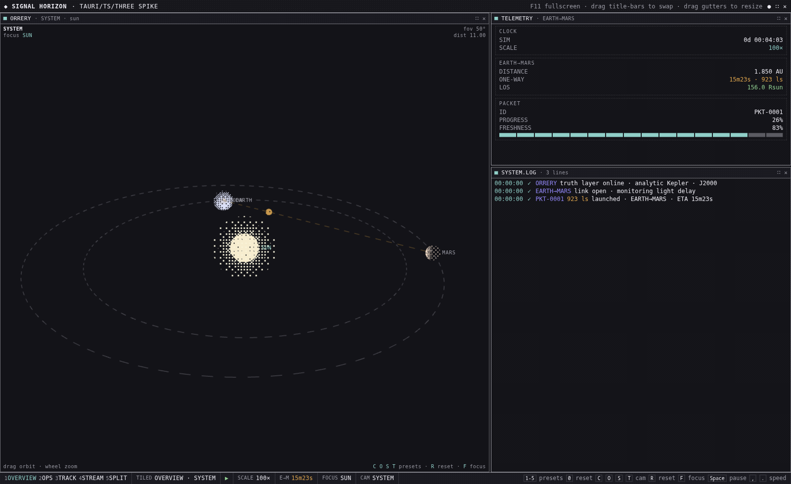
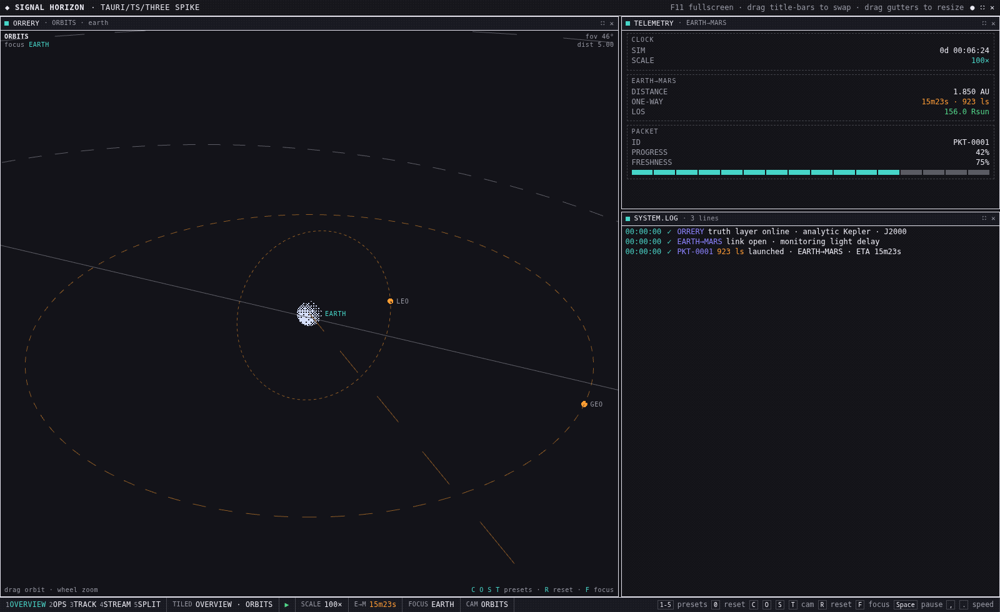
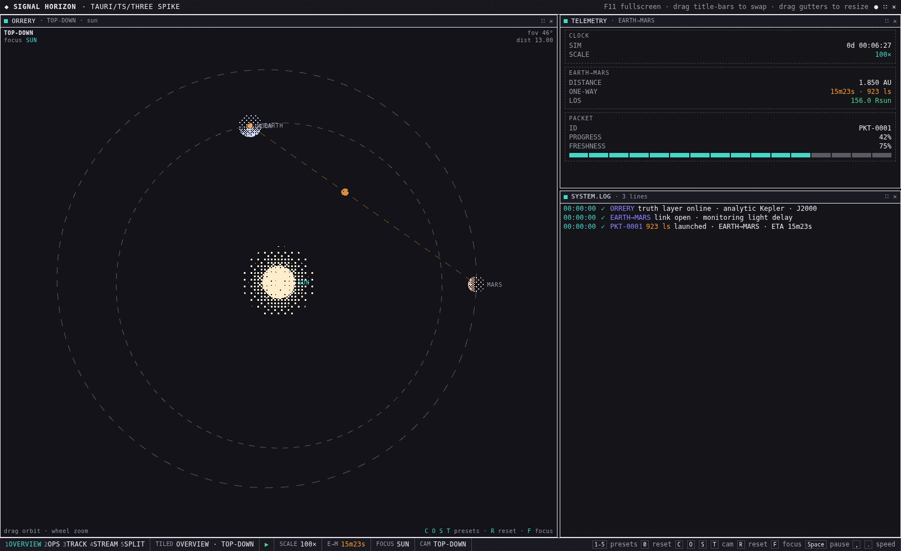
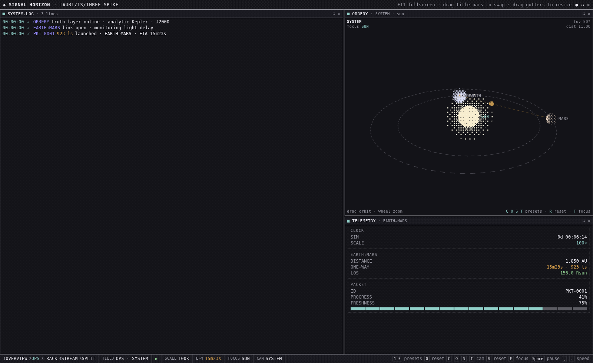
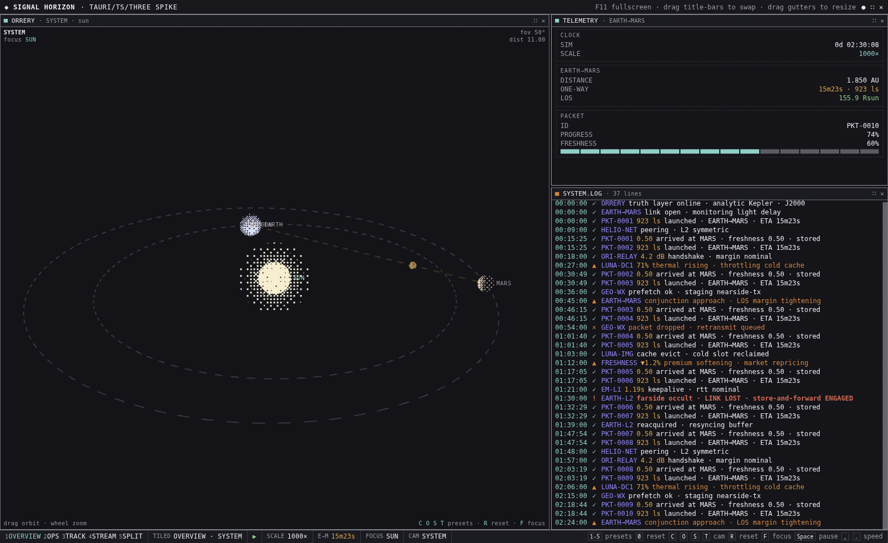

# Progress — 2026-05-29 · Spike day 1

First (and effectively complete) build pass of the Tauri/TS/Three.js spike. Built
Chromium-first (Tauri deferred), verified headful in ungoogled-chromium on the GPU.

## What got built
- **Sim truth layer** ported from C# and pinned: `ephemeris.ts` is bit-identical to the
  real `SignalHorizon.Sim.Ephemeris` (golden master generated by compiling the unmodified
  C# sources). 14/14 Vitest pass; `tsc --noEmit` clean.
- **DD-10 tiling WM** in the DOM: zone-grid model + always-tiled invariant, drag-to-swap
  with a drop-target overlay, gutter resize, 5 data-driven presets, instant switching.
- **Three.js orrery**: floating-origin rebase + per-preset log-compression, dithered
  billboards, dashed rings, four animated camera presets, and the honest light-speed packet.
- **Panels** (fanned out across 3 subagents against a shared contract): SYSTEM.LOG with
  severity syntax highlighting, live telemetry with a freshness gauge, bottom status strip.

## Verification (headful ungoogled-chromium 148, real GPU)

OVERVIEW + SYSTEM camera — orrery hero, telemetry + log rail. Packet at 31% matches the
PROGRESS 31% / 923 ls readout:

ORBITS camera — **orbital planes read clearly**: GEO equatorial (wide flat ellipse), LEO
inclined ~53° (tilted ring), sats labelled, Earth→Mars link spearing through:

TOP-DOWN — plan/map view of the Earth & Mars orbits with the packet crawling the link:

OPS preset — one keystroke swaps the whole layout (SYSTEM.LOG hero-left, orrery + telemetry
right). The orrery's WebGL canvas resizes in place (not destroyed):

SYSTEM.LOG at 1000× — packet launch/arrive (cyan) plus the scripted severity feed
(warn=amber, error/crit=red), freshness gauge draining:

## Notable findings (carried into FINDINGS.md)
- f64 orbital math ports to TypeScript with **zero loss** (bit-identical to .NET here).
- Iteration speed (HMR sub-second, browser DevTools, no engine build) is the headline
  advantage — every screenshot/polish cycle above was seconds, not an editor round-trip.
- Headless WebGL2 works via ANGLE/SwiftShader; headful uses the real GPU (much nicer 3D).

## Tooling set up
- `tools/golden/` C# golden-master generator (compiles the real sources, no copy).
- `tools/shoot.mjs` Playwright screenshot driver (headful by default).
- Playwright **MCP** server registered (`.mcp.json`) pointed at ungoogled-chromium —
  loads on Claude Code restart for interactive driving.

## Adversarial review → fixes
A 25-agent review workflow (find → adversarially verify each finding) confirmed **7** real
issues out of 21 raw and rejected the rest. All 7 fixed the same session (tsc clean, 14/14
tests, re-screenshotted, no regression): orrery per-frame allocation (~960 `Vector3`/frame →
scratch + `Float32Array`), terminator computed in compressed space, WM gesture-listener
stacking, `freshness()` degenerate branch vs C#, resize divider drift, stale drag hit-test,
and the orrery titlebar lamp. See `../backlog.md` for the list.

## Next
- FINDINGS.md verdict + recommendation (written).
- (If it graduates) wrap in Tauri, re-validate under WebKitGTK — the one open gate.
